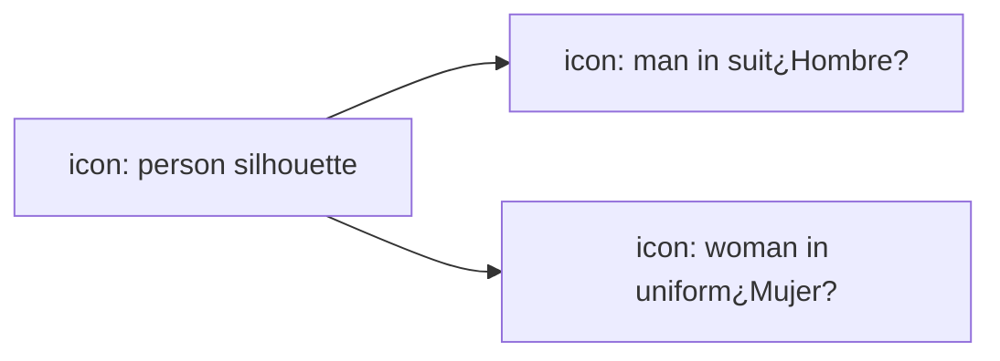
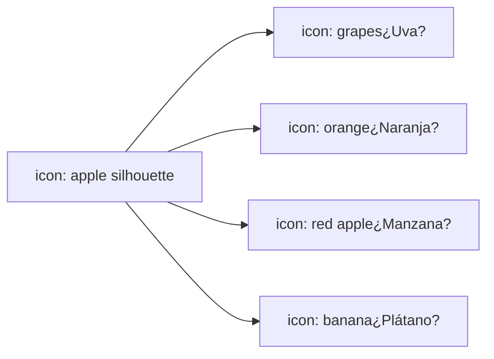

```mermaid
graph TD
    ML["Machine Learning"]
    AS["Aprendizaje supervisado"]
    ANS["Aprendizaaje no supervisado"]
    
    ML --> AS
    ML --> ANS
    
    Clas["Clasificación"]
    Regr["Regresión"]
    Clust["Clustering"]
    Otras["Otras"]
    
    AS --> Clas
    AS --> Regr
    ANS --> Clust
    ANS --> Otras
    
    RL["Regresion logística"]
    SVM["SVM"]
    RN1["Red neuronal"]
    DT1["Decision Tree"]
    RF1["Random Forest"]
    GBDT1["GBDT"]
    KNN["KNN"]
    NB["Naive Bayes"]
    
    Clas --> RL
    Clas --> SVM
    Clas --> RN1
    Clas --> DT1
    Clas --> RF1
    Clas --> GBDT1
    Clas --> KNN
    Clas --> NB
    
    RLin["Regresión lineal"]
    MVS["MVS"]
    RN2["Red neuronal"]
    DT2["Decision Tree"]
    RF2["Random Forest"]
    GBDT2["GBDT"]
    
    Regr --> RLin
    Regr --> MVS
    Regr --> RN2
    Regr --> DT2
    Regr --> RF2
    Regr --> GBDT2
    
    KM["K-Means"]
    CJ["Clusters jerárquicos"]
    ABD["Agrupamiento basado en ladensidad"]
    
    Clust --> KM
    Clust --> CJ
    Clust --> ABD
    
    RC["Regla -Correlacion"]
    PCA["Análisis del componente principal (PCA)"]
    MMG["Modelo de mezcla gaussiana(MMG)"]
    
    Otras --> RC
    Otras --> PCA
    Otras --> MMG
```

Machine Learning

icon: brain with circuit connections

# Aprendizaje Supervisado
# Regresión

Lic. Patricia Rodríguez Bilbao

logo: brain with circuit connections

# Contenido

1. Introducción

2. Regresión

3. Arboles de Decisión

4. SVM

5. KNN

Machine Learning Lic. Patricia Rodríguez Bilbao

# Algoritmos de Aprendizaje automático

logo: brain with circuit connections

Machine Learning Lic. Patricia Rodríguez Bilbao

logo: brain with circuit connections

# Regresión lineal

* **Regresión lineal**: un método de análisis estadístico para determinar las relaciones cuantitativas entre dos o más variables a través del análisis de regresión en estadísticas matemáticas.

* La regresión lineal es un tipo de aprendizaje supervisado.

| X | Y |
| --- | --- |
| -20 | 2 |
| -10 | 4 |
| 0 | 5 |
| 10 | 7 |
| 20 | 8 |
| 30 | 10 |
| 40 | 11 |
| 50 | 13 |
| 60 | 14 |

Regresión lineal unaria

| X1 | X2 | Y |
| --- | --- | --- |
| [icon: 3D plot] | [icon: 3D plot] | [icon: 3D plot] |

Regresión lineal multidimensional

Machine Learning

Lic. Patricia Rodríguez Bilbao

logo: brain and circuit icon

# Regresión lineal

La función del modelo de regresión lineal es la siguiente, donde $w$ indica el parámetro de ponderación, $b$ indica el sesgo y $x$ indica el atributo de la muestra.

$$h_w(x) = w^T x + b$$

La relación entre el valor predicho por el modelo y el valor real es la siguiente, donde $y$ indica el valor real y $\varepsilon$ indica el error.

$$y = w^T x + b + \varepsilon$$

El error $\varepsilon$ está influenciado por muchos factores de forma independiente. Según el teorema del límite central, el error $\varepsilon$ sigue una distribución normal. Según la función de distribución normal y la estimación de máxima verosimilitud, la función de pérdida de la regresión lineal es la siguiente:

$$J(w) = \frac{1}{2m} \sum (h_w(x) - y)^2$$

Para que el valor previsto se acerque al valor real, debemos minimizar el valor de pérdida. Podemos usar el método de descenso de gradiente para calcular el parámetro de peso $w$ cuando la función de pérdida alcanza el mínimo y luego completar la construcción del modelo.

Machine Learning

Lic. Patricia Rodríguez Bilbao

# Regresión polinómica

logo: brain and circuit icon

La regresión polinómica es una extensión de la regresión lineal. En general, la complejidad de un conjunto de datos excede la posibilidad de que se pueda ajustar por una línea recta. Es decir, la falta de adecuación obvia ocurre si se utiliza el modelo de regresión lineal original. La solución es utilizar la regresión polinómica.

$$ h_w(x) = w_1x + w_2x^2 + \dots + w_nx^n + b $$

* donde, la enésima potencia es una dimensión de regresión polinomial (grado).

* La regresión polinomial pertenece a la regresión lineal ya que la relación entre sus parámetros de peso $w$ sigue siendo lineal, mientras que su no linealidad se refleja en la dimensión de la característica.

| X | Linear (Miles per gallon) | Degree 2 (Miles per gallon) | Degree 5 (Miles per gallon) |
| --- | --- | --- | --- |
| 50 | 33 | 40 | 35 |
| 100 | 22 | 22 | 22 |
| 150 | 15 | 14 | 16 |
| 200 | 8 | 15 | 22 |

Comparación entre regresión lineal y regresión polinómica

Machine Learning

Lic. Patricia Rodríguez Bilbao

logo: brain and circuit

# Regresión - prevención de sobreajuste

Los términos de regularización se pueden utilizar para reducir el sobreajuste. El valor de *w* no puede ser demasiado grande o demasiado pequeño en el espacio de muestra. Puede agregar una pérdida de suma cuadrada en la función de destino.

$$ J(w) = \frac{1}{2m} \sum (h_w(x) - y)^2 + \lambda \sum \|w\|_2^2 $$

**Términos de regularización (norma):** El término de regularización aquí se denomina L2-norma. La regresión lineal que utiliza esta función de pérdida también se denomina regresión Ridge.

$$ J(w) = \frac{1}{2m} \sum (h_w(x) - y)^2 + \lambda \sum \|w\|_1 $$

La regresión lineal con pérdida absoluta se denomina regresión de Lasso.

Machine Learning

Lic. Patricia Rodríguez Bilbao

logo: brain and circuit icon

# Regresión logística

Regresión logística: el modelo de regresión logística se utiliza para resolver problemas de clasificación. El modelo se define de la siguiente manera:

$$ P(Y = 1|x) = \frac{e^{wx+b}}{1 + e^{wx+b}} $$
$$ P(Y = 0|x) = \frac{1}{1 + e^{wx+b}} $$

donde *w* indica el peso, *b* indica el sesgo, y *wx+b* se considera como la función lineal de *x*. Compare los dos valores de probabilidad anteriores. La clase con un valor de probabilidad más alto es la clase de *x*.

| x | y |
| --- | --- |
| -6 | 0 |
| -4 | 0.02 |
| -2 | 0.12 |
| 0 | 0.5 |
| 2 | 0.88 |
| 4 | 0.98 |
| 6 | 1 |

Machine Learning

Lic. Patricia Rodríguez Bilbao

icon: brain with circuit connections

# Regresión logística

Tanto el modelo de regresión logística como el modelo de regresión lineal son modelos lineales generalizados. La regresión logística introduce factores no lineales (la función sigmoide) basados en la regresión lineal y establece umbrales, por lo que puede tratar los problemas de clasificación binaria.

Según la función modelo de regresión logística, la función de pérdida de la regresión logística se puede estimar de la siguiente manera utilizando la estimación de máxima verosimilitud:

$$ J(w) = -\frac{1}{m} \sum (y \ln h_w(x) + (1 - y) \ln(1 - h_w(x))) $$

donde $w$ indica el parámetro de peso, $m$ indica el número de muestras, $x$ indica la muestra e $y$ indica el valor real. Los valores de todos los parámetros de peso $w$ también se pueden obtener a través del algoritmo de descenso de gradiente.

Machine Learning Lic. Patricia Rodríguez Bilbao

logo: brain and circuit nodes

# Extensión Regresión logística- Función Softmax

La regresión logística sólo se aplica a problemas de clasificación binaria. Para problemas de clasificación multi-clase, utilice la función Softmax.

**Problema de clasificación binaria**

**Problema de clasificación de varias clases**

Machine Learning

Lic. Patricia Rodríguez Bilbao

# Extensión Regresión logística- Función Softmax

icon: brain with circuit connections

* La regresión Softmax es una generalización de la regresión logística que podemos usar para la clasificación de clase K.

* La función Softmax se utiliza para asignar un vector K-dimensional de valores reales arbitrarios a otro vector K-dimensional de valores reales, donde cada elemento vectorial está en el intervalo (0, 1).

* La función de probabilidad de regresión de Softmax es la siguiente:

$$ p(y = k \mid x; w) = \frac{e^{w_k^T x}}{\sum_{l=1}^{K} e^{w_l^T x}}, k = 1, 2 \cdots, K $$

Machine Learning

Lic. Patricia Rodríguez Bilbao

logo: brain with circuit connections

# Extensión Regresión logística- Función Softmax

Softmax asigna una probabilidad a cada clase en un problema de varias clases. Estas probabilidades deben sumar 1.

Softmax puede producir un formulario perteneciente a una clase particular. Ejemplo:

| Categoría. | Probabilidad |
| --- | --- |
| ¿Uva? | 0,09 |
| ¿Naranja? | 0,22 |
| ¿Manzana? | 0,68 |
| ¿Plátano? | 0,01 |

* **Suma de todas las probabilidades:**
    - 0.09 + 0.22 + 0.68 + 0.01 = 1
* Lo más probable es que esta foto sea una manzana.

**Machine Learning**

**Lic. Patricia Rodríguez Bilbao**

icon: brain with circuit connections

Gracias......

Machine Learning Lic. Patricia Rodríguez Bilbao