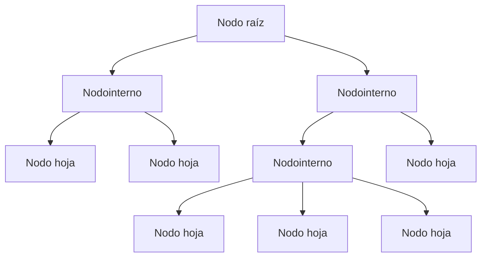
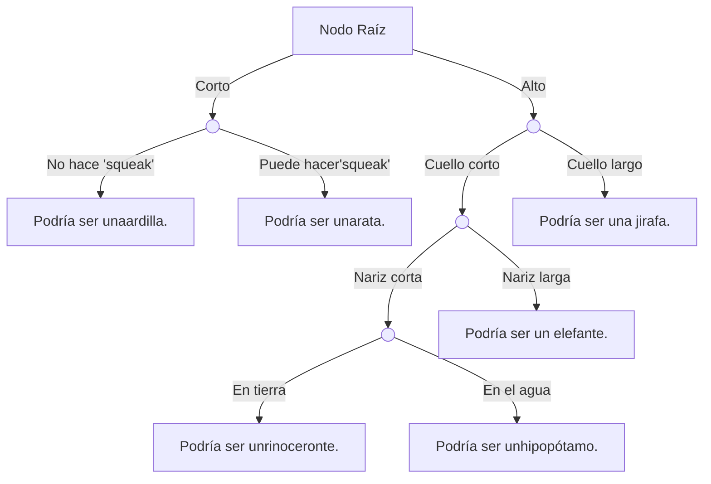
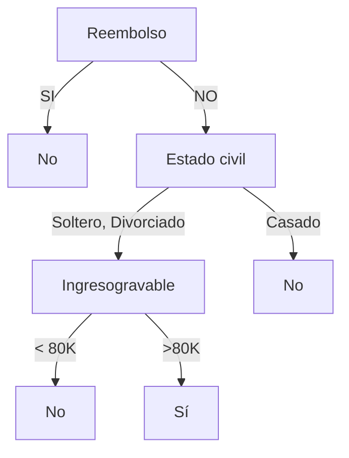
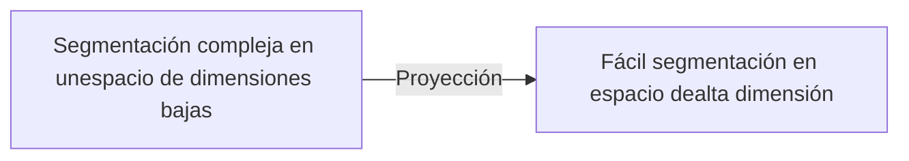
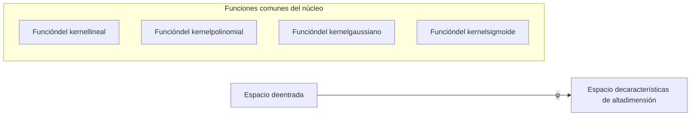

Machine Learning

icon: brain with circuit connections

# Aprendizaje Supervisado Arboles de Decisión

Lic. Patricia Rodríguez Bilbao

icon: brain with circuit connections

# Contenido

1. Introducción

2. Regresión

3. Arboles de Decisión

4. SVM

5. KNN

Machine Learning

Lic. Patricia Rodríguez Bilbao

logo: brain with circuit connections

## Definición

Estructura de árbol (binario o no)

* Cada nodo no-hoja representa una prueba en un atributo de función.

* Cada rama representa la salida de un atributo de función en un cierto rango de valores, y

* Cada nodo hoja almacena una categoría.

Para utilizar el árbol de decisiones, inicie desde el nodo raíz, pruebe los atributos de las funciones de los elementos que se van a clasificar, seleccione las ramas de salida y utilice la categoría almacenada en el nodo hoja como resultado final.

Machine Learning

Lic. Patricia Rodríguez Bilbao

logo: brain with circuit connections

## Definición

Cómo construir un árbol de decisiones es muy importante.

* Determinar la estructura topológica de los atributos de las características seleccionando los atributos basados en valores cuantitativos.

* El paso clave es dividir los atributos, construyendo diferentes ramas en función de las diferencias

Los algoritmos de aprendizaje comunes incluyen ID3, C4.5 y CART.

Machine Learning Lic. Patricia Rodríguez Bilbao

# Puntos clave para construcción

icon: brain with circuit connections

El paso clave de la construcción de un árbol de decisión es dividir los datos de todos los atributos de entidad, comparar los conjuntos de resultados en términos de 'pureza' y seleccionar el atributo con la "pureza" más alta como punto de datos para la división del conjunto de datos.

Las métricas para cuantificar la "pureza" incluyen la entropía de información y el índice GINI.
La fórmula es la siguiente:

$$ H(X) = - \sum_{k=1}^{K} p_k \log_2(p_k) \qquad \qquad Gini = 1 - \sum_{k=1}^{K} p_k^2 $$

donde $p_k$ indica la probabilidad de que la muestra pertenezca a la clase $k$ (hay clases $K$ en total). Una mayor diferencia entre la pureza antes de la segmentación y que después de la segmentación indica un mejor árbol de decisión

Machine Learning Lic. Patricia Rodríguez Bilbao

logo: brain with circuit connections

## Proceso de construcción

**Selección de funciones:** Seleccione una característica/función de los datos de formación como estándar dividido del nodo actual. (Diferentes estándares generan diferentes algoritmos de árbol de decisiones.)

**Generación de árbol de decisiones:** Genere el nodo interno boca abajo en función de las características seleccionadas y deténgalo hasta que el conjunto de datos ya no pueda dividirse.

**Poda:** El árbol de decisiones puede convertirse fácilmente en un exceso a menos que se realice la poda necesaria (incluyendo la prepoda y la poda posterior) para reducir el tamaño del árbol y optimizar su estructura de nodo.

Machine Learning Lic. Patricia Rodríguez Bilbao

logo: brain with circuit connections

# Ejemplo

Este muestra una clasificación cuando se utiliza un árbol de decisiones. El resultado de la clasificación se ve afectado por tres atributos: Reembolso, Estado civil e Ingresos gravables.

| Tid. | Reembolso | Estado civil | Ingreso gravable | Engaño |
| --- | --- | --- | --- | --- |
| 1. | Si | Soltero | 125.000. | No |
| 3 | No | Casado | 100.000 | No |
| 3 | No | Soltero | 70.000 | No |
| 4 | Sí | Casado | 120.000 | No |
| 5 | No | Divorciado | 95.000 | Sí |
| 6 | No | Casado | 60.000 | No |
| 7 | Sí | Divorciado | 220.000 | No |
| 8 | No | Soltero | 85.000 | Sí |
| 9 | No | Casado | 75.000 | No |
| 10 | No | Soltero | 90.000 | Sí |

Machine Learning Lic. Patricia Rodríguez Bilbao

# SVM (Support Vector Machine)

logo: brain and circuit icon

Es un modelo de clasificación binaria cuyo modelo básico es un clasificador lineal definido en el espacio propio (eigenspace) con el intervalo más grande. Las MVS también incluyen trucos del kernel que las convierten en clasificadores no lineales. El algoritmo de aprendizaje de MVS es la solución óptima para la programación cuadrática convexa.

| 身高 (cm) | 体重 (kg) | Gender |
| --- | --- | --- |
| 152 | 55 | Women |
| 155 | 50 | Women |
| 160 | 53 | Women |
| 165 | 65 | Women |
| 170 | 61 | Women |
| 165 | 70 | Men |
| 170 | 85 | Men |
| 173 | 75 | Men |
| 180 | 68 | Men |
| 185 | 80 | Men |

<footer>

Lic. Patricia Rodríguez Bilbao
</footer>

Machine Learning

icon: brain with circuit connections

## SVM (Support Vector Machine)

Las principales ideas de SVM incluyen dos puntos:

* En el caso de la inseparabilidad lineal, se utilizan algoritmos de mapeo no lineal para convertir las muestras linealmente inseparables del espacio de entrada de baja dimensión en el espacio propio (eigenspace) de alta dimensión. De esta manera, las muestras son linealmente separables. A continuación, el algoritmo lineal se puede utilizar para analizar las características no lineales de las muestras.

* Basándose en el principio de minimización del riesgo estructural, se construye un hiperplano óptimo en el propio espacio, de modo que el aprendiz/alumno se optimiza globalmente, y la expectativa de todo el espacio de muestra satisface un límite superior con una cierta probabilidad.

Machine Learning Lic. Patricia Rodríguez Bilbao

logo: brain with circuit connections

## SVM Lineal

¿Cómo dividimos los conjuntos de datos rojo y azul por una línea recta?

| X | Y | Series |
| --- | --- | --- |
| 2 | 4 | Red |
| 3 | 6 | Red |
| 4 | 5 | Red |
| 5 | 7 | Red |
| 6 | 9 | Red |
| 8 | 8 | Red |
| 4 | 2 | Red |
| 2 | 2 | Red |
| 5 | 4 | Red |
| 4 | 8 | Blue |
| 5 | 6 | Blue |
| 6 | 5 | Blue |
| 7 | 4 | Blue |
| 8 | 3 | Blue |
| 9 | 5 | Blue |
| 10 | 7 | Blue |
| 6 | 2 | Blue |
| 7 | 1 | Blue |

icon: arrow pointing right

| X | Y | Series |
| --- | --- | --- |
| 2 | 4 | Red |
| 3 | 6 | Red |
| 4 | 5 | Red |
| 5 | 7 | Red |
| 6 | 9 | Red |
| 8 | 8 | Red |
| 4 | 2 | Red |
| 2 | 2 | Red |
| 5 | 4 | Red |
| 4 | 8 | Blue |
| 5 | 6 | Blue |
| 6 | 5 | Blue |
| 7 | 4 | Blue |
| 8 | 3 | Blue |
| 9 | 5 | Blue |
| 10 | 7 | Blue |
| 6 | 2 | Blue |
| 7 | 1 | Blue |
| Decision Boundary: Steep positive slope line separating clusters |  |  |

o

| X | Y | Series |
| --- | --- | --- |
| 2 | 4 | Red |
| 3 | 6 | Red |
| 4 | 5 | Red |
| 5 | 7 | Red |
| 6 | 9 | Red |
| 8 | 8 | Red |
| 4 | 2 | Red |
| 2 | 2 | Red |
| 5 | 4 | Red |
| 4 | 8 | Blue |
| 5 | 6 | Blue |
| 6 | 5 | Blue |
| 7 | 4 | Blue |
| 8 | 3 | Blue |
| 9 | 5 | Blue |
| 10 | 7 | Blue |
| 6 | 2 | Blue |
| 7 | 1 | Blue |
| Decision Boundary: Shallow positive slope line separating clusters |  |  |

Con clasificación binaria
Conjunto de datos bidimensional

Tanto los métodos izquierdo como derecho se pueden utilizar para dividir los conjuntos de datos. ¿Cuál de ellos es el correcto?

Machine Learning

Lic. Patricia Rodríguez Bilbao

icon: brain with circuit connections

## SVM no lineal

* Las líneas rectas se utilizan para dividir los datos en diferentes clases. La idea central de la MVS es encontrar una línea recta y mantener el punto cerca de la línea recta lo más **lejos** posible de la línea recta. Estos puntos se llaman **vectores de apoyo**.

* En el espacio bidimensional, usamos líneas rectas para la segmentación. En el espacio de alta dimensión, usamos **hiperplanos** para la segmentación.

| X-coordinate | Y-coordinate | Class |
| --- | --- | --- |
| 0.1 | 0.2 | Red |
| 0.15 | 0.4 | Red |
| 0.2 | 0.6 | Red |
| 0.25 | 0.3 | Red |
| 0.3 | 0.5 | Red |
| 0.35 | 0.7 | Red |
| 0.4 | 0.9 | Red |
| 0.5 | 0.8 | Red |
| 0.6 | 0.1 | Blue |
| 0.65 | 0.3 | Blue |
| 0.7 | 0.5 | Blue |
| 0.75 | 0.2 | Blue |
| 0.8 | 0.4 | Blue |
| 0.85 | 0.6 | Blue |
| 0.9 | 0.7 | Blue |

| X-coordinate | Y-coordinate | Class | Support Vector |
| --- | --- | --- | --- |
| 0.1 | 0.2 | Red | No |
| 0.15 | 0.4 | Red | No |
| 0.2 | 0.6 | Red | No |
| 0.25 | 0.3 | Red | No |
| 0.3 | 0.5 | Red | No |
| 0.35 | 0.7 | Red | No |
| 0.4 | 0.9 | Red | No |
| 0.5 | 0.8 | Red | No |
| 0.45 | 0.55 | Red | Yes |
| 0.55 | 0.4 | Red | Yes |
| 0.6 | 0.1 | Blue | No |
| 0.65 | 0.3 | Blue | No |
| 0.7 | 0.5 | Blue | No |
| 0.75 | 0.2 | Blue | No |
| 0.8 | 0.4 | Blue | No |
| 0.85 | 0.6 | Blue | No |
| 0.9 | 0.7 | Blue | No |
| 0.62 | 0.62 | Blue | Yes |

Distancia entre vectores de soporte es lo más lejos posible

Machine Learning Lic. Patricia Rodríguez Bilbao

logo: brain with circuit connections

## SVM no lineal

¿Cómo clasificamos un conjunto de datos separable no lineal?

chart: scatter plot showing linearly separable blue and red dots with a dividing line

chart: scatter plot showing non-linearly separable blue and red dots

La MVS lineal puede funcionar bien para conjuntos de datos lineales separables.

Los conjuntos de datos no lineales no se pueden dividir con líneas rectas.

Machine Learning Lic. Patricia Rodríguez Bilbao

logo: brain and circuit icon

## SVM no lineal

* Las funciones del kernel se utilizan para construir MVS no lineales.

* Las funciones del kernel permiten que los algoritmos se ajusten al hiperplano más grande en un espacio de características de alta dimensión transformado.

### Funciones comunes del núcleo

Machine Learning Lic. Patricia Rodríguez Bilbao

icon: brain with circuit connections

Gracias......

Machine Learning Lic. Patricia Rodríguez Bilbao