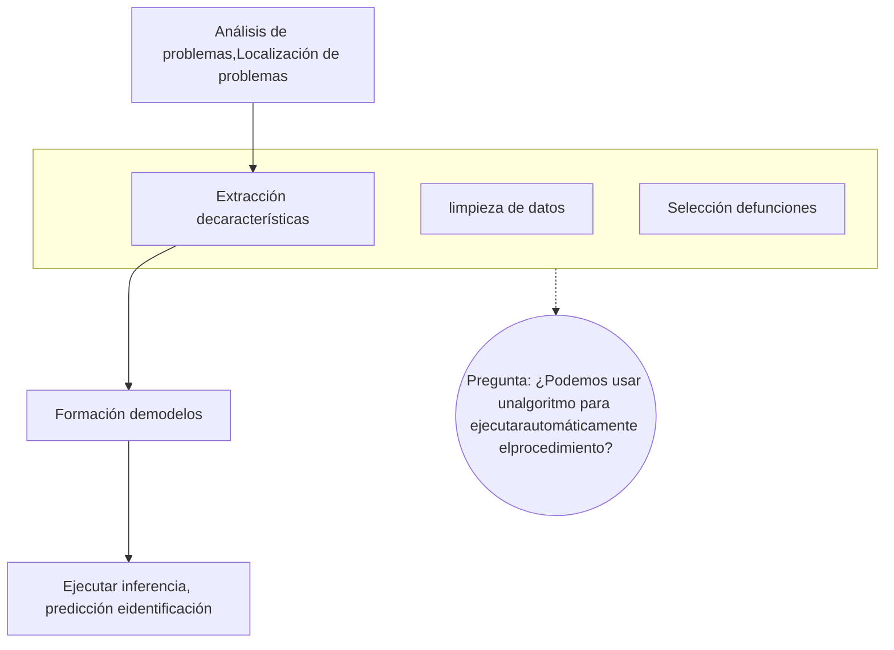
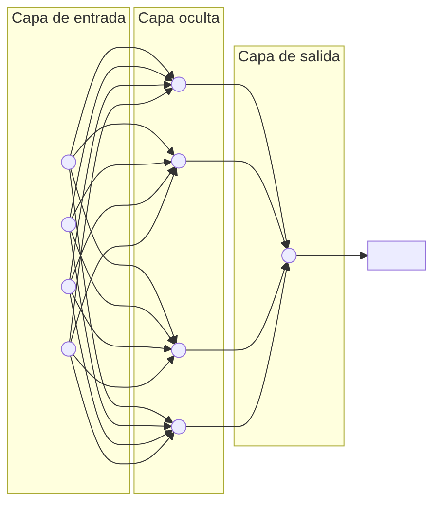
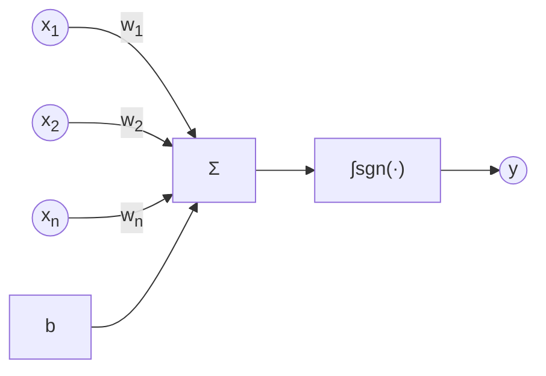
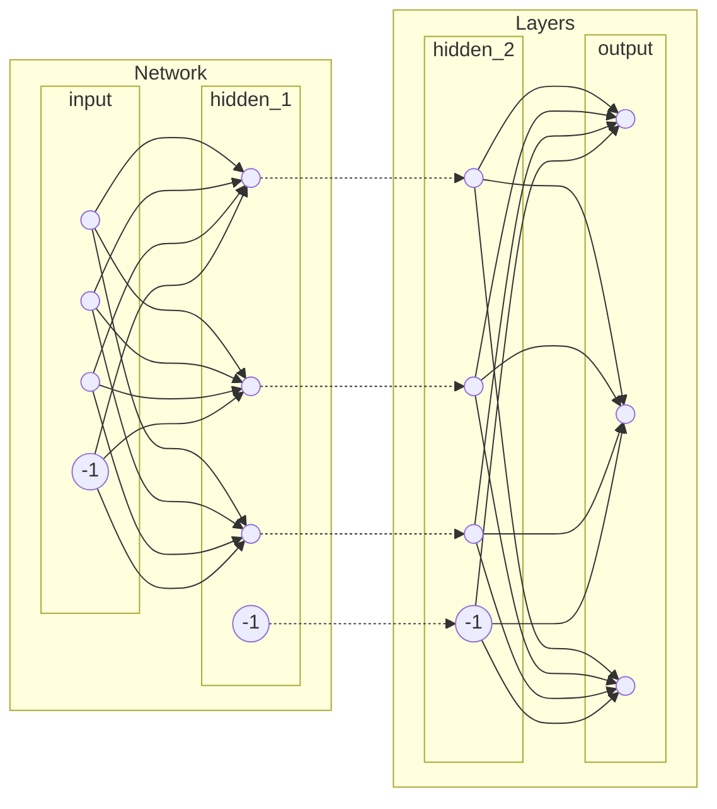
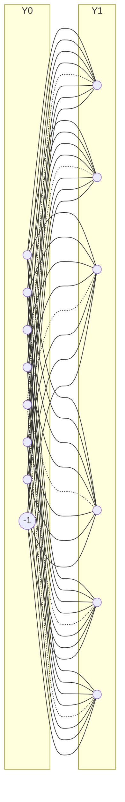
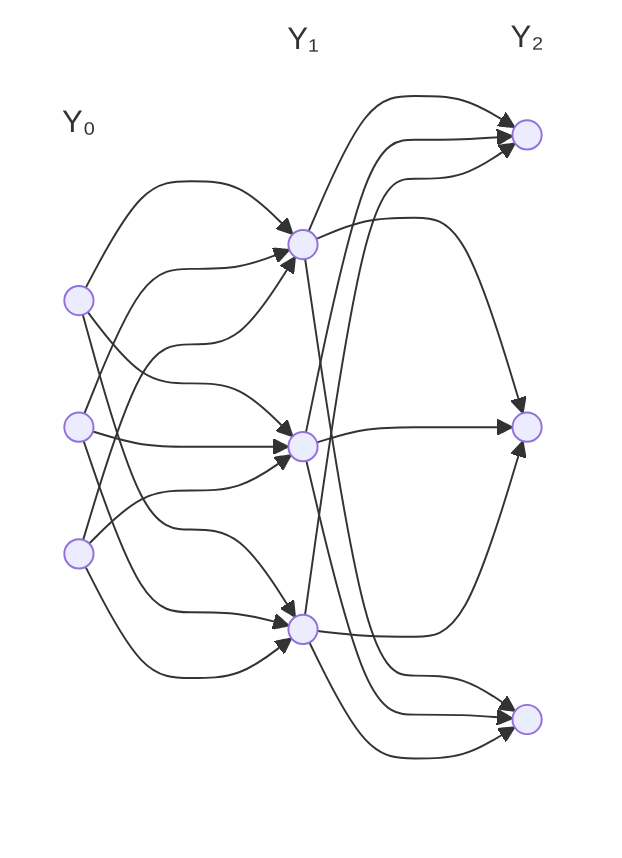
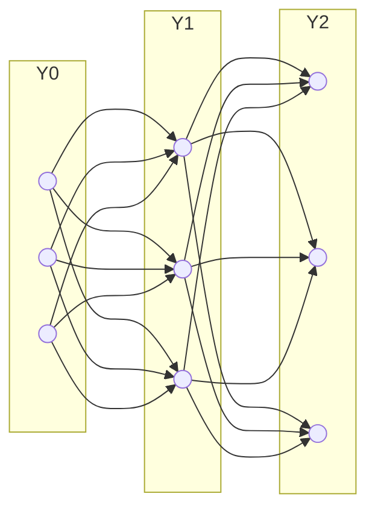
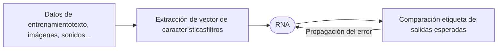
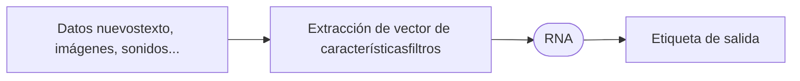

Machine Learning logo: brain with circuit connections

# Aprendizaje Supervisado Deep Learning

Lic. Patricia Rodríguez Bilbao

# Contenido

icon: brain with circuit connections

1. Definiciones

2. Función de activación

3. Red Neuronal

4. Tipos de redes neuronales

5. Problemas comunes

Machine Learning

Lic. Patricia Rodríguez Bilbao

# Definición

icon: brain and circuit nodes

| Machine Learning tradicional | Aprendizaje profundo |
| --- | --- |
| Bajos requisitos de hardware en el equipo: Dada la cantidad de computación limitada, el equipo no necesita una GPU para computación paralela | Mayores requisitos de hardware en el ordenador: Para ejecutar operaciones matriciales en datos masivos, el ordenador necesita una GPU para realizar computación paralela. |
| Aplicable a entrenamiento con una pequeña cantidad de datos y cuyo rendimiento no se puede mejorar continuamente a medida que aumenta la cantidad de datos. | El rendimiento puede ser alto cuando se proporcionan parámetros de peso de alta dimensión y datos de entrenamiento masivos. |
| Desglose por niveles del problema | Aprendizaje de extremo a extremo (E2E) |
| Selección manual de funciones | Extracción automática de funciones basada en algoritmos |
| Funciones fáciles de explicar | Funciones difíciles de explicar |

Machine Learning	Lic. Patricia Rodríguez Bilbao

logo: brain with circuit connections

# Aprendizaje automático tradicional

Machine Learning

Lic. Patricia Rodríguez Bilbao

logo: brain with circuit connections

# Aprendizaje profundo

Generalmente, la arquitectura de aprendizaje profundo es una red neural artificial profunda. "Profundo" en "aprendizaje " se refiere al número de capas de la red neural

illustration: Red neuronal humana con etiquetas Dendrita, Núcleo, Axon y Sinapsis

Red neuronal humana

Perceptrón

illustration: Red neural profunda con múltiples capas de nodos interconectados

Red neural profunda

**Machine Learning**

**Lic. Patricia Rodríguez Bilbao**

logo: brain with circuit connections

# Neurona Artificial

$$y = sgn(\sum_{i} x_{i} \cdot w_{i} - b)$$

Machine Learning

Lic. Patricia Rodríguez Bilbao

logo: brain with circuit connections

# La función de transferencia

**Lineal**
$$ s(x) = x $$

**Escalón**
$$ s(x) = sgn(x) $$

**Sigmoidea Binaria**
$$ s(x) = \frac{1}{1 + e^{-x}} $$

**Sigmoidea Bipolar**
$$ s(x) = tanh(x) $$

Machine Learning

Lic. Patricia Rodríguez Bilbao

logo: brain with neural connections

# Red Neuronal

Weights
Units

Machine Learning

Lic. Patricia Rodríguez Bilbao

icon: brain with neural connections

## Postulado de Hebb

photo: Donald Hebb

> "Cuando el axón de una célula A está lo suficientemente cerca como para excitar a una célula B y repetidamente toma parte en la activación, ocurren procesos de crecimiento en una o ambas células de manera que tanto la eficiencia de la célula A, como la capacidad de excitación de la célula B son aumentadas."

The Organization of Behavior
Donald Hebb. (1949)

Machine Learning Lic. Patricia Rodríguez Bilbao

logo: brain and circuit icon

# Parámetros

### dataset

illustration: pixelated data column X

illustration: pixelated data column Z

X Z

### network

Y0 Y1

Machine Learning Lic. Patricia Rodríguez Bilbao

logo: brain with circuit connections

# Función de Costo

illustration: matrix multiplication visualization showing vector X, matrix W, and resulting vectors Y and Z

$$ Y = s(X \cdot W) $$

$$ E = \sum \|Z - Y\|^2 $$

$$ E = \sum \|Z - s(X \cdot W)\|^2 $$

Machine Learning

Lic. Patricia Rodríguez Bilbao

logo: brain with circuit connections

# La Regla Delta

X
illustration: vertical grayscale vector X

W
illustration: colored weight matrix W

$$ Y = s(X \cdot W) $$

$$ E = \sum \|Z - Y\|^2 $$

$$ E = \sum \|Z - s(X \cdot W)\|^2 $$

$$ W^{[t+1]} = W^{[t]} + \Delta W^{[t]} $$

Y illustration: horizontal grayscale vector Y

$$ \Delta w_{ij} = \eta \cdot x_i \cdot (z_j - y_j) $$

Z illustration: horizontal grayscale vector Z

Machine Learning

Lic. Patricia Rodríguez Bilbao

logo: brain and circuit icon

# El Perceptrón Multicapa

$\Delta W_1$ $\Delta W_2$

$$\Delta W_2 = \eta \cdot Y_1^T \cdot (Z - Y_2)$$

$$\Delta W_1 = \eta \cdot Y_0^T \cdot (? - Y_1)$$

chart: 3D surface plot showing a peak and surrounding ripples on a grid

Machine Learning

Lic. Patricia Rodríguez Bilbao

logo: brain and circuit icon

# Retropropagación del error

$$ Y_0 = X $$
$$ Y_1 = s_1(Y_0 \cdot W_1) $$
$$ Y_2 = s_2(Y_1 \cdot W_2) $$

$$ D_2 = (Z - Y_2) \cdot Y_2' $$
$$ \Delta W_2 = \eta \cdot (Y_1^T \cdot D_2) $$

$$ \Delta w_{ij} = -\eta \cdot \frac{\partial E}{\partial w_{ii}} $$

$$ D_1 = (D_2 \cdot W_2^T) \cdot Y_1' $$
$$ \Delta W_1 = \eta \cdot (Y_0^T \cdot D_1) $$

$$ Y_l' = s'(Y_{l-1} \cdot W_l) $$

Machine Learning

Lic. Patricia Rodríguez Bilbao

# Mejoras a Backpropagation

logo: brain with circuit connections

Fair Condition: Backprop Learn=.01 Momentum=0, 593 Iterations

| BIAS -> F | E |
| --- | --- |
| 0 | 0 |
| 1 | 2.5 |
| 2 | 2.8 |
| 3 | 2.4 |

Fair Condition: Quickprop, 26 Iterations

| BIAS -> F | E |
| --- | --- |
| 0 | 0 |
| 1 | 2.4 |
| 1.5 | 2.2 |
| 2 | 2.1 |
| 2.5 | 1.9 |
| 3 | 1.8 |

Fair Condition: Backprop Learn=.01 Momentum=.9, 80 Iterations

| BIAS -> F | E |
| --- | --- |
| 0 | 0 |
| 1 | 2.5 |
| 2 | 3.8 |
| 2.5 | 1.5 |
| 3 | 3.2 |
| 3.2 | 1.8 |
| 3.5 | 2.2 |

Fair Condition: RProp, 29 Iterations

| BIAS -> F | E |
| --- | --- |
| 0 | 0 |
| 1 | 1.5 |
| 2 | 2.1 |
| 2.5 | 1.9 |

Machine Learning

Lic. Patricia Rodríguez Bilbao

## Aprendizaje

logo: brain with circuit connections

Mundo Real Parametrización

## Reconocimiento

Mundo Real Parametrización

Machine Learning

Lic. Patricia Rodríguez Bilbao

logo: brain with circuit connections

# Historia del desarrollo de las RNA

| Year | Milestone | Period |
| --- | --- | --- |
| 1958 | Perceptrón | La Edad de Oro |
| 1970. | XOR | Invierno de AI |
| 1986. | PMC |  |
| 1995. | MVS |  |
| 2006. | Red profunda |  |

Machine Learning

Lic. Patricia Rodríguez Bilbao

icon: brain with circuit connections

Gracias......

Machine Learning Lic. Patricia Rodríguez Bilbao